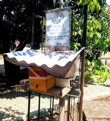

<h1>Sistema de gerenciamento de abelhas sem ferrão</h1>

Colmeia Localizada CEFET-MG campus 2

As abelhas são seres vivos muito   importantes   que   constituem   a   fauna   terrestre,   sãoresponsáveis por mais de dois terços da polinização e, sem elas, a vida de várias espécies estáameaçada. Em 2016, as abelhas foram colocadas na lista de espécies em extinção pelo UnitedStates Fish and Wildlife Service (FWS)

Foi desenvolvido um sistema de monitoramento de colmeias com o uso de recursos IoT. Esse sistema funciona capturando e tratando dados que são analisados e usados para a criação de gráficos,tabelas   e   a   emissão   de   alertas   no   aplicativo   e   no   site,   com   o   intuito   de   avisar   pessoas responsáveis e evitar danos físicos às colmeias como, por exemplo, invasões, roubos e ataquespor   outros   animais.   Além   de   contribuir   para   pesquisas   e   estudos   que demandam   coletascontínuas de dados de colmeias.O sistema proposto é constituído das seguintes partes:

<ul>
  <li>Microcontrolador e Sensores:   inicialmente   composta   por   sensores de temperatura e umidade e o microcontrolador ESP-32</li>
  <li>Central  de  dados:  um  servidor  web   que  recebe  os   dados coletados,  processa armazena-os.</li>
</ul>  

O sistema poderá ajudar apicultores de pequena e larga escala no controle sobre acolmeia, evitando perdas biológicas e contribuindo para a preservação das abelhas.

