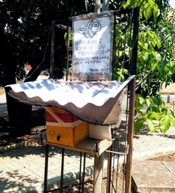
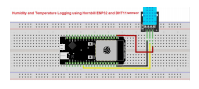
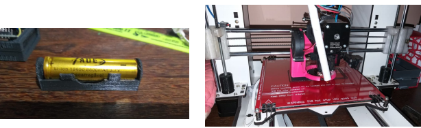

<h1>Sistema de gerenciamento de abelhas sem ferrão.</h1>

Colmeia Localizada CEFET-MG campus 2, para projeto apresentado na META (Mostra Específica de Trabalhos e Aplicações) 2019 

As abelhas são seres vivos muito importantes   que   constituem   a   fauna   terrestre,   são responsáveis por mais de dois terços da polinização e, sem elas, a vida de várias espécies estão ameaçadas. Em 2016, as abelhas foram colocadas na lista de espécies em extinção pelo UnitedStates Fish and Wildlife Service (FWS)

Foi desenvolvido então diante todos esses problemas um sistema de monitoramento de colmeias com o uso de recursos IoT. Esse sistema funciona capturando e tratando dados que são analisados e usados para a criação de gráficos,tabelas  no   site,   com   o   intuito   de   avisar   pessoas responsáveis e evitar danos físicos às colmeias. Além   de   contribuir   para   pesquisas   e   estudos   que demandam   coletas contínuas de dados de colmeias.O sistema proposto é constituído das seguintes partes:

<h2>Materiais Usados</h2>

<ul>
  <li>Microcontrolador e Sensores:   inicialmente   composto   por   sensores de temperatura e umidade e o microcontrolador ESP-32</li>
  <li>Central  de  dados:  um  servidor  web   que  recebe  os   dados coletados,  processa armazena-os.</li>
</ul>  

O sistema poderá ajudar apicultores de pequena e larga escala no controle sobre acolmeia, evitando perdas biológicas e contribuindo para a preservação das abelhas.

Imprimindo o módulo para colocar a bateria com uma impressora 3D.

